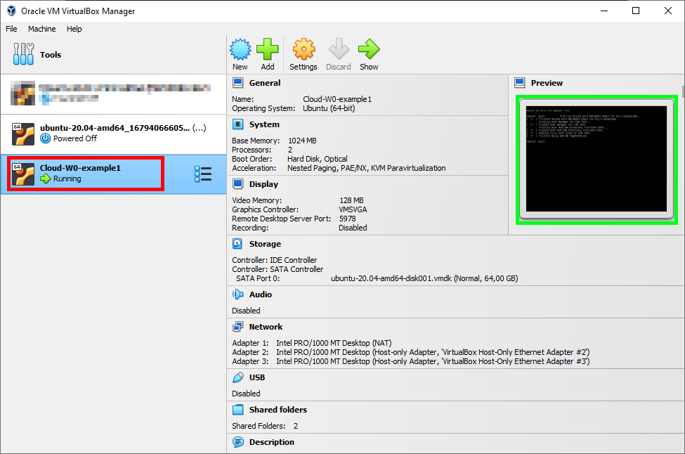

# Cloud Computing and Virtualization - Work 0

This repository contains a set of examples used in class to illustrate what is vagrant and how to use it.

## Known issues and fixes
Under Win10/11 there seems to be some issues with vagrant+VirtualBox.

Namely, the VM will timeout during the `vagrant up` process, normally under the `SSH auth method: private key` instruction. There is no clear solution to this, some reports point to the Microsoft Hyper-V and WSL2 conflicting with VirtualBox, others suggest adding cpus and other VM configs.

### Possible solutions
1. The solution might be [**_quite simple and stupid_**](https://github.com/hashicorp/vagrant/issues/11987#issuecomment-777256616) - when a VM is starting, **just make sure you have the VirtualBox GUI (window) open and select that specific VM that is trying to boot** (see the image below, click / select the VM currently hanging - in red, you should also see some activity under the preview screen - green).
2. Other possible problem is a conflict with Hyper-V. Just open (search) the "Windows Features" / "Funcionalidades do Windows" option and deactivate Hyper-V. See https://stackoverflow.com/a/68788355/5145402



For other possible solutions [check this](https://oracle-base.com/blog/2022/09/18/vagrant-ssh-auth-method-private-key-timed-out/), namely:
* Just run `vagrant halt` and `vagrant up` again and wait.
* Add 2 cpus and more memory to the machine?
* Virtualbox 7 is not supported (I use it with no problems), maybe try 6.1.
* Disable VirtualMachinePlaftorm windows feature, in PowerShell with admin privileges:
  1. `Disable-WindowsOptionalFeature -Online -FeatureName "VirtualMachinePlatform"`
  2. Reboot, work with vagrant as you need.
  3. When you need WSL2, `Enable-WindowsOptionalFeature -Online -FeatureName "VirtualMachinePlatform"`


Another issue I found is the following error, in this case just had to make sure the VM is destroyed, and then go to the VMs folder (in my case `C:\Users\RenatoPanda\VirtualBox VMs\`) and delete the specific folder.
```bash
==> default: Setting the name of the VM: Cloud-W0-example1
The name of your virtual machine couldn't be set because VirtualBox
is reporting another VM with that name already exists. Most of the
time, this is because of an error with VirtualBox not cleaning up
properly. To fix this, verify that no VMs with that name do exist
(by opening the VirtualBox GUI). If they don't, then look at the
folder in the error message from VirtualBox below and remove it
if there isn't any information you need in there.

VirtualBox error:

VBoxManage.exe: error: Could not rename the directory 'C:\Users\RenatoPanda\VirtualBox VMs\temp_clone_1679424302597_64181' to 'C:\Users\RenatoPanda\VirtualBox VMs\Cloud-W0-example1' to save the settings file (VERR_ALREADY_EXISTS)
VBoxManage.exe: error: Details: code E_FAIL (0x80004005), component SessionMachine, interface IMachine, callee IUnknown
VBoxManage.exe: error: Context: "SaveSettings()" at line 3641 of file VBoxManageModifyVM.cpp
```

## Example 0 - vagrant 101
This folder is empty, used to demo the first steps and commands on how to use vagrant. Follow along:

Vagrant uses a Vagrantfile on the project root to describe the VMs that should be provisioned. The file is written in Ruby and can be initialized with `vagrant init` or `vagrant init <boxname>`.
Vagrant can use several hypervisors to provision VMs, namely virtualbox, VMware, parallels, hyper-v, but also AWS, docker, ESXi, terraform and others. The default one is VirtualBox.

### Commands to test:

```bash
cd example_0
vagrant init # creates the default vagrant file, inspect it with an editor
rm Vagrantfile # remove the file

vagrant init bento/ubuntu-20.04 # same, but setting the VM image to bento/ubuntu-20.04
vagrant up # launches the VM using the default provider (VirtualBox in our case) - open the VirtualBox application / GUI to see the VMs running).
# if you have problems with SSH key injection read above.

vagrant status # guess what?
vagrant global-status # status of all VMs provisioned with vagrant

vagrant box list # lists the VM images currently available locally

vagrant suspend # suspends the machine
vagrant resume # resumes a suspended vagrant machine
vagrant halt # stops the vagrant machine
vagrant reload # restarts the vagrant machine, loads new Vagrantfile configuration
vagrant help # shows all other available commands

vagrant destroy # destroys the VM (on the current folder), this means deleting it from VirtualBox, but the Vagrantfile stays and can be used with vagrant up to recreate it again.
vagrant destroy vm_id # by id, available under global-status
```

Inside the project folder there is a `.vagrant` folder that **should not be deleted before destroying the VM**. To do that just run `vagrant destroy`. It should not be versioned too, so add to `.gitignore` if needed (see this repo .gitignore).

Inspect the VM config under the VirtualBox GUI. You will see that it has a random name starting with the project folder name, that is `example_0_default_.`, it has 2GB RAM, 2 CPUs and one network adapter (NAT) - image below. Also, we just started and destroyed the image without entering it or seeing anything. Example 1 will explain this a bit more.


## Example 1 - Changing VM configuration and entering it

At this moment you should be asking what is the point of this?

By default, vagrant VMs run in **headless mode**, in other words, the virtual machine is running in the background without any foreground elements visible. Typically they are accessed via SSH. **Think of this as a remote server**.

Still, we can use Vagrantinit to change the machine configs or activate the GUI. Next, some brief explanations of the example_1 `Vagrantfile`:

```ruby
Vagrant.configure("2") do |config|

  config.vm.box = "bento/ubuntu-20.04" # using the same base image

  config.vm.provider "virtualbox" do |vb|
    vb.gui = true # Display the VirtualBox VM window when booting the machine
    vb.name = "Cloud-W0-example1" # change VM name under VirtualBox
    vb.memory = "1024" # set RAM
    vb.cpus = 2 # number of CPUs
    vb.customize ["modifyvm", :id, "--vram", "128"] # 128MB video memory
    vb.linked_clone = true # linked clone instead of full copy (see below)
  end

  # add two network adapters with specific IPs
  config.vm.network "private_network", ip: "192.168.33.10"
  config.vm.network "private_network", ip: "192.168.44.10"

  # config an additional shared folder host <-> guest
  config.vm.synced_folder "../img", "/vagrant_ipt"
end
```
Run this example `cd example_1` && `vagrant up` and inspect your VirtualBox window.

You will notice that a VM window popped out this time (image below) - still it is just a terminal, since our base box is not running a desktop environment such as gnome or KDE (default user / pwd = vagrant).


Now inspect the VM configs under VirtualBox window (image below). This time you will see two new VMs, since we used `linked_clone = true`, the first one (`ubuntu-20.04-...`) is the master and the remaining VMs will clone this saving space and time. In the `Cloud-W0-example1` VM you will see our changes such as 1024MB of memory, 2 CPUs, 128 MB Video Memory, 2 shared folders and 3 network adapters (one NAT and the two private network ones that we created).


### Accessing the VM

To access the VM just run `vagrant ssh` under the project folder. After this point you are issuing commands inside the guest machine, where you can configure or run the desired software or tests.

One important vagrant concept is that the VMs aumatically **share** the project holder (**host**) under `/vagrant` on every **guest** VM. A few commands to test this:

```bash
vagrant ssh # enters the VM
# my suggestion under Windows is to use Terminal + git bash, but feel free to use powershell instead.

# now you should be inside the VM (you should see vagrant@vagrant:~$).

# just test some Linux commands:
pwd # current dir
whoami # current user
uname -a # prints system info (guest)

# now check the shared folder
cd /vagrant
ls # list files, these are the files you have on your project folder
cat hello.txt # check the content of file hello.txt
echo "Hello from <my name>!" > hello_again.txt # see the file appearing also in your host machine
ip addr # lists the guest network interfaces, you will see 4 of them
# 1) loopback, 2) eth0 (NAT), 3) eth1 with 192.168.33.10/24, 4) eth2 with 192.168.44.10/24
```

Remember that in our Vagrantfile we also added a second share (`config.vm.synced_folder "../img", "/vagrant_ipt"`). That is sharing the host `img` folder, outside of `example_1` to the folder `vagrant_ipt` inside the guest VM. Do a brief test on that and install jp2a to "view" the image as ASCII.
```bash
cd /vagrant_ipt # enter the dir
ls # view content, there should be a easter_logo.jpg
sudo apt install jp2a -y # install jp2a, a simple JPEG to ASCII converter
jp2a easter_logo.jpg --colors # weee

logout # exit back to your host

vagrant destroy -f # destroy the vagrant VM (current folder)
```

## Example 2 - multi machine setup

Two of the great features in vagrant are:
1. Configuring multi-machine scenarios in a single Vagrantfile
2. Provisioning each machine with specific instructions (shell scripts or more advanced options)

### Multiple VMs
To setup various machines you use the following syntax:
```ruby
# -*- mode: ruby -*-
# vi: set ft=ruby :

Vagrant.configure("2") do |config|

  # Configuration for vm01
  config.vm.define "vm01" do |vm01|
    vm01.vm.box = "bento/ubuntu-20.04"
    # (...)
    vm01.vm.provider "virtualbox" do |vb|
      vb.name = "Cloud-W0-example2-vm01"
      # (...)
    end
  end

  # Configuration for vm02
  config.vm.define "vm02" do |vm02|
    vm02.vm.box = "bento/ubuntu-20.04"
    # (...)
    vm02.vm.provider "virtualbox" do |vb|
      vb.name = "Cloud-W0-example2-vm02"
    # (...)
    end
  end

end
```
Here, we are defining two distinct VMs `vm01` and `vm02`. Each can have different boxes and configurations.

### Provisioning
In addition, you can use the Vagrantfile to provision the VMs - this means configure it as required to a specific scenario. To this end, we can use shell scripts, inline commands or advanced tools such as Ansible of Chef. These are run on the first `vagrant up`, when we reload the configuration `vagrant reload` or by running `vagrant provision` (see manual for other options).

Check the `example_2/Vagrantfile` to see some examples on how to provision a machine. Below is a brief description:
```ruby
# Provision block for vm02 only using a shell script, run as normal (unprivileged) user
# this means that hello.sh will be moved to vm02 and executed.
Vagrant.configure("2") do |config|
  # (...)
  config.vm.define "vm02" do |vm02|
    #(...)  
    vm02.vm.provision "shell", path: "./hello.sh", privileged: false
  end
  
  #(...)

  # Provision block for both VMs, here we use an inline block.
  # This means that all the code between "RANDOMWORD" will be executed inside the VM.
  # In this case, each VM will excute this and output its hostname.
  # The "\033[42m" and "\033[0m" are used just to give some color to the messages.
  # This is also marked as "run: always", so will run everytime we start the VMs.
  config.vm.provision "shell", run: "always", inline: <<-RANDOMWORD
    echo -e "\033[42mHello from both vms! I am $(hostname)!\033[0m"
  RANDOMWORD
end
```

### Using vagrant in a multi-machine scenario
Go ahead, inspect the `Vagrantfile` for `example_2` and launch it with `vagrant up`. After both machines are provisioned, you should see something as the image below. Notice that messages start with the name of the guest (`vm01` or `vm02`) and the `echo` from the provision scripts are also present.


In multi-machine scenarios you need to add the VM name to specific commands. For instance, test these:
```bash
vagrant up # launches all VMs
vagrant suspend vm01 # suspends only vm01 (see VirtualBox)
vagrant resume vm01 # resumes vm01 only
vagrant ssh vm02 # enters vm02, you should see vagrant@vm02:~$
logout # exit vm02, back to host
vagrant provision vm01 # rerun provision scripts on vm01
vagrant provision # rerun on all VMs
vagrant destroy # destroys the VMs
```
## Lessons learned
By now you should understand what vagrant is and why it is useful. It allows us to "create and configure lightweight, reproducible, and portable development environments", using local virtualization tools such as VirtualBox, but also in the cloud with AWS or using containers such as Docker.

This will allow us to setup and test multi-machine scenarios in our course, to better understand concepts such as load balancing, service discovery, high-availability, or to deploy container clusters.

**Important Notes:**
* **DO NOT** forget to turn off all running VMs. Check with `vagrant global-status`.
* **DO NOT** delete folders with VMs without destroying them first (`vagrant destroy`).
# W1 - Wordpress provisioning
Regarding the wordpress assignment, just provision your VM or VMs (challenge = web + db) following one of the many guides available. For example:
https://ubuntu.com/tutorials/install-and-configure-wordpress
